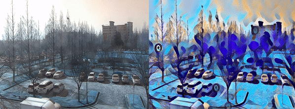

# Video-Style-Transfer
Fast Style Transfer for Real-Time Video


The model uses the method described in [Perceptual Losses for Real-Time Style Transfer and Super-Resolution](https://arxiv.org/abs/1603.08155) along with [Instance Normalization](https://arxiv.org/pdf/1607.08022.pdf). The saved-models for examples shown in the README can be downloaded from [here](https://www.dropbox.com/s/lrvwfehqdcxoza8/saved_models.zip?dl=0).
<p align='center'></p>
<p align='center'></p>


# Requirements
   - Python 3.5.2
   - OpenCV 3.4.2
   - Numpy 1.14.3
   - argparse 1.1
   - Pytorch 0.4.1
   
# Usages
## download repo
  - download this repo by the following instruction:
    
        $ git clone https://github.com/brightyoun/Video-Style-Transfer.git
        $ cd Video-Style-Transfer
        
## Demo
  - Demo
          
        $ python neural_style.py eval --model saved_models/[MODEL_PATH] --cuda [1]

## Train model
```bash
python neural_style/neural_style.py train --dataset </path/to/train-dataset> --style-image </path/to/style/image> --save-model-dir </path/to/save-model/folder> --epochs 2 --cuda 1
```

# References
   - [ Perceptual Losses for Real-Time Style Transfer and Super-Resolution] (https://link.springer.com/chapter/10.1007/978-3-319-46475-6_43)
   
# Contacts
   - Email : brightyoun@gist.ac.kr
